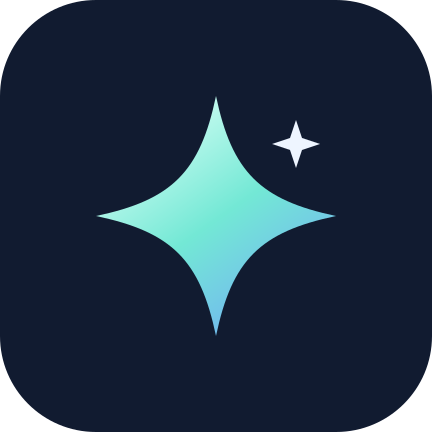

# StellaShell



Androidの外部画面をデスクトップとして使う、Shizukuベースの独立したDesktop Shell。Sony SOG06 / Android 14 と REDMAGIC NX809J / Android 16 で検証しています。Dextop の topology API・アクセシビリティミラー・Flutter は使いません。本体の標準ホームは変更しません。

## Requirements / 通常のセットアップ

- Android **11以上**（minSdk 30）。動作検証はSony SOG06 / Android 14、REDMAGIC NX809J / Android 16。
- **Shizuku API 13以降**が起動・許可済み。タスク一覧、移動、リサイズなどの完全なウィンドウ操作に必要。
- 端末frameworkの **freeform windowing対応**。OEMによって対応APIや動作が異なります。
- **multi-display対応**と外部ディスプレイ（物理出力、またはscrcpyの仮想画面）。本体画面のみのタブレットモードは未実装。
- 「他のアプリの上に表示」の許可。

通常の導入は **Shizuku → StellaShell** です。初めてなら [Shizuku公式セットアップ](https://shizuku.rikka.app/guide/setup/) を参照し、StellaShellの設定画面でShizuku接続・許可、操作バーの表示許可、Desktop Shell用の設定、開始の順に進めてください。

Shizuku停止時は設定画面に状態を表示します。Shizuku側で起動した後、**「Shizuku に接続・許可」** で再試行できます。StellaShell自体はADBサーバーの管理・ペアリング・Shizukuの自動起動を行いません。

### Advanced / self-ADB（任意）

Termuxから自己ADBを利用したい場合のみ、[初回セットアップ](tools/setup-self-adb.sh) と日常用 [adb5555](tools/adb5555) を利用できます。[使い方・制約](tools/README.md) を参照してください。これらはStellaShellの必須セットアップではなく、Shizukuの起動を代行するものでもありません。

## 0.5.4: ウィジェット表示・壁紙・新アイコン・言語対応

- ウィジェット編集バーの **⋮** → **通常／強制リサイズ／縦横比を維持して拡大**。設定は配置したウィジェットごとに保存。
- 固定サイズのウィジェットでも後者2つは縦横に変更可能。拡大は中身を固定サイズで描画し、縦横比を保って表示するため余白が出る場合があります。
- **描画サイズ…** で拡大前の幅・高さを調整、**推奨サイズに戻す** で提供側の初期サイズ＋ホスト余白へ復元。提供側の内部レイアウト不具合まで保証するものではありません。
- デスクトップの **⋮ → 壁紙 → 画像を選ぶ…**。画像は最大辺2048pxに正規化してアプリ内へ保存。画面いっぱい／全体表示を選べ、従来のグラデーションにも戻せます。本体ホームの壁紙は変更しません。
- `sllsll` と星の新しいadaptive icon（テーマアイコン対応）。
- 日本語／英語に対応。端末の言語に従い、Android 13以降ではOSのアプリ別言語設定でも選択できます。その他の言語は英語へフォールバック。[翻訳の追加方法](docs/LOCALIZATION.md)。

[0.5.4の検証と制限](docs/VERIFICATION-0.5.4.md)

## 0.5.3: StellaShellへ改名

旧称はSOG Desktop。アプリIDを `net.fuyumori.stellashell` に変更しました。旧版とは別アプリとしてインストールされ、設定・起動プロファイル・ウィジェットは自動移行されません。Shizukuとオーバーレイの許可も新しいアプリに付与してください。

## 0.5.2: 背面ウィンドウのタイトルバーとウィジェット編集

- 非アクティブ窓にも暗めのタイトルバーを表示。バーから前面化し、そのままドラッグできます。
- Androidのタスク重なり順に従って、前面窓に隠れるバー部分は描画・入力の両方を除去。重なり順APIが利用できない端末では従来のアクティブ1枚にフォールバックします。
- リサイズ枠は操作対象の窓に表示。タスクバー更新で進行中のドラッグを破棄しないように修正。
- ウィジェット編集パネルを本体の外側に配置。通常の配置・サイズは保持し、提供側がリサイズ非対応の場合は「固定サイズ」と表示します。
- [検証記録](docs/VERIFICATION-0.5.2.md)。

## 0.5.1: REDMAGIC のウィンドウ追従修正

- REDMAGIC NX809J / Android 16 で、タイトルバーだけ動いてアプリ本体が残る問題を修正。
- Android 16以降では対応APIを確認し、Shell transition経由で座標と描画を更新。旧Androidの従来経路は維持。
- 実機でドラッグ中の追従、マウスリサイズ、最大化／復元、左右スナップを確認。診断に使用経路を表示。
- 他のAndroid 16端末や物理USB出力を一律に保証するものではありません。
- 調査・検証記録: [REDMAGIC-SURFACE-INVESTIGATION](docs/REDMAGIC-SURFACE-INVESTIGATION.md)。

## 0.5: 自由配置とウィンドウ枠

- デスクトップのショートカットを自由配置。マウスは直接ドラッグ、タッチは長押し → **移動** → ドラッグ。
- 移動モード中に同じアイコンをタップ／戻るで取消。位置は Activity 単位・dp座標で保存。
- 空白メニューの **アイコンをグリッドに吸着** は任意（初期オフ、24dp刻み）。
- 解像度変更時は表示位置だけ画面内に補正。移動し直さない限り、元の保存座標を維持。
- アイコン以外の空白部分はウィジェットの入力を遮らない。
- 常時表示していたリサイズ帯を撤去。端の入力領域を残し、ホバー／操作中だけ細い線を表示。
- タイトルバーの操作ボタンは文字記号ではなくベクター描画。ホバー時の強調、閉じるボタンの赤色フィードバックを追加。

## 0.4: 起動プロファイルと Android ウィジェット

- Start・デスクトップ・タスクバーのアイコンを **右クリック／長押し** → アプリの起動設定。
- 起動モードはウィンドウ・最大化・フルスクリーン・前回の状態。サイズは 800×600 / 1280×720 / 幅と高さを50% / 前回 / カスタム。位置は自動・中央・前回。
- 設定は Activity ごとに保存。既存の窓を「開く」とサイズ変更せず前面へ戻します。プロファイル変更は次回の新規起動に適用します。
- 「新しいウィンドウ」は別タスクを要求しますが、アプリの launchMode 等で既存窓になる場合はその旨を表示します。
- 通常のウィンドウ位置・サイズを記憶し、最大化／フルスクリーンとは別に保持します。画面が小さくなった場合は画面内へ補正します。
- 空白の長押し／右クリック、または右上の **⋮** → **ウィジェットを追加**。Android 標準の作成許可と、必要なら提供アプリの設定を経由します。
- 配置後は編集モード。上の帯で移動、右下でリサイズ（対応ウィジェットのみ）、×で削除。メニューの **ウィジェットの編集を終了** で通常の操作に戻ります。
- ウィジェットの ID・位置・サイズは再接続後も保持。追加の取り消し／削除時には、その ID だけ解放します。既存ホームの widget host は操作しません。
- 空白メニューからショートカット追加、3種類の壁紙、表示設定、Desktop settings を開けます。

ウィジェット内部から開くアプリは提供元の PendingIntent に従い、StellaShell の起動プロファイルを通るとは限りません。提供アプリごとの互換性・設定画面の表示先は実機確認が必要です。本体画面（タブレット用）対応はまだ含みません。

## 0.3 の操作

- 通常画面は壁紙＋任意のショートカットだけ。初期状態は空です。
- **Start** に全アプリ一覧と検索を集約。
- Start のアプリを長押し → 起動設定／バーへのピン留め／デスクトップへの追加。
- バーは **ピン留め＋この画面で開いているタスク**。最近使った履歴ではありません。
- バーのアイコンをクリックして既存タスクを前面へ。長押し／右クリックでウィンドウ操作メニュー。
- アクティブな freeform ウィンドウの上に操作タイトルバーを表示。タイトル部分をドラッグして移動、四辺・四隅をドラッグしてリサイズ。
- タイトルバーの左／右半分・最小化・最大化／復元・閉じるを使用できます。最大化はアプリを freeform のまま作業領域いっぱいに配置し、下のバーを残します。
- 「▱」はデスクトップ表示。ウィンドウを閉じずに隠し、バーから戻せます。
- トレイの丸印は Shizuku 接続状態、時計、歯車は設定。「−」でバーを折り畳み、「▦」で復帰。
- 終了は設定または常駐通知から。通知の「デスクトップへ戻る」はバーが見えないときの復帰口です。

非アクティブ窓にもタイトルバーを残します。アプリ・タイトルバー・タスクバーをクリックすると操作対象が切り替わります。前面の窓に隠れるバー部分は表示・入力とも切り取ります。

## scrcpy の独立画面

`DEVICE_IP` はADB接続済み端末のIPアドレスに置き換えてください。

```sh
scrcpy -s "$DEVICE_IP:5555" --new-display=1920x1080/160 \
  --no-vd-system-decorations --display-ime-policy=local \
  --start-app=net.fuyumori.stellashell
```

初回は本体で「他のアプリの上に表示」、通知、Shizuku を許可。設定の **Desktop Shell 用に設定する** は、freeform を有効にし、Android の強制デスクトップモードをオフにします。変更前の値を保存し、復元できます。適用後は scrcpy / USB を再接続してください。

`force_desktop_mode_on_external_displays=1` は `--no-vd-system-decorations` にかかわらず Android のナビゲーション領域を作り、バーの入力を奪います。0.3 の実機設定は **force desktop=0 / freeform=1** です。これは本体のホームアプリ変更ではありません。

Shizuku が切れるとタスク一覧・ウィンドウ操作は停止します。全画面アプリ起動は通常 API でも可能ですが、freeform 指定時は接続エラーを表示し、別画面へ勝手に転送しません。

## 現時点の制限

- Android のロック画面や「画面設定」など overlay 禁止画面では、バーと操作枠も非表示になります。通常の戻る操作／常駐通知でデスクトップへ戻してください。禁止を解除する回避策は入れていません。
- リサイズ枠はアクティブな1枚のみ。タイトルバーは見えている各freeform窓に表示しますが、完全なOSウィンドウマネージャーの置換ではありません。
- アプリ独自の最小サイズ・向き制約は OS に制限される場合があります。
- 物理 USB モニタはこの版で未検証。複数モニタ同時ではなく1画面を選択します。
- システム通知トレイ、キーボードのスナップショートカットは未実装。
- タスク監視は通常約1.1秒、複数窓表示時は約0.3秒間隔。外部からの前後関係変更にはその遅延があります。ドラッグは最新位置に集約し、Binder 要求を無制限に積みません。

## ビルドと検証

JDK 17、Android SDK Platform 35 / Build Tools 35.0.0 が必要です。`ANDROID_HOME` を設定するか、ローカルの `local.properties` に `sdk.dir` を指定してください。Gradle 8.11.1 はWrapperで取得します。

```sh
./gradlew testDebugUnitTest lintDebug assembleDebug
```

APK: `app/build/outputs/apk/debug/app-debug.apk`（開発用署名）

[0.5 の検証](docs/VERIFICATION-0.5.md) / [0.4 の検証](docs/VERIFICATION-0.4.md) / [0.3 の検証とAPI調査](docs/VERIFICATION-0.3.md) / [0.2 の記録](docs/VERIFICATION-2026-09-28.md)

## Special Thanks / 参考プロジェクト

StellaShellの設計・調査・実機検証を支えてくれた、先行プロジェクトとその開発者の皆さんに感謝します。

- **[Taskbar](https://github.com/farmerbb/Taskbar)** — Braden Farmer / contributors。Androidの外部ディスプレイ、freeform window、Startメニュー・タスクバー構成の参考に。
- **[Dextop](https://github.com/NarYuki/Dextop)** — NarYuki / contributors。Androidデスクトップ環境の着想と、framework・端末ごとの互換性を調べる際の参考に。
- **[scrcpy](https://github.com/Genymobile/scrcpy)** — Genymobile / contributors。独立した仮想ディスプレイとPCからの表示・操作を通じて、StellaShellの開発・検証を支えるツールとして。

These projects inspired our design and made device testing possible. Thank you to their maintainers and contributors.

参考・謝辞と、APKに含まれる依存ライブラリの表記は区別しています。依存関係・ライセンスと調査時の参照コミットは [Third-party notices](THIRD_PARTY_NOTICES.md) を参照してください。各プロジェクトによるStellaShellの公式な推奨・提携を示すものではありません。
