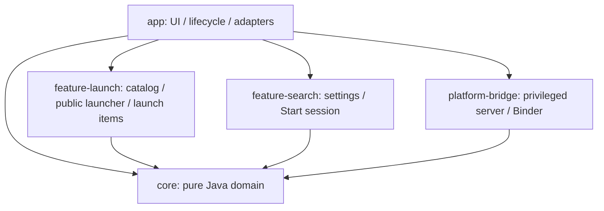

# モジュール構成と拡張

ファイルの大小ではなく、依存方向と状態の所有者で分ける。Android application の `app` は配線・画面・platform adapter を担当し、再利用する規則や独立機能を所有しない。



## 配置と契約

| Gradle module / directory | 所有する責務 | 依存してはいけないもの |
| --- | --- | --- |
| `:core` / `core/` | geometry、launch profile、task/display/input policy、限定transaction、検索URL、起動routeと直列queue | Android、JSON、View、app・feature・platformの実装 |
| `:feature-search` / `features/search/` | 検索設定の保存・購読とwindow単位の明示検索操作 | app型、Bridge、ShellRuntime、他feature |
| `:feature-launch` / `features/launch/` | app catalog、公開launcher解決、4系統pins・recent・desktop配置の保存 | app型、Bridge、ShellRuntime、他feature |
| `:platform-bridge` / `platform/bridge/` | 特権task・display・input・density・capture操作とAIDL server | app画面、app resources、app保存設定、ShellRuntime |
| `:app` / `app/` | Activity/Service入口、View、配線、起動executor・Shell coordinator、保存adapter、Shell/task owner | 下位moduleの内部stateを別の正本として保持すること |

core は Java 17 library。他のmoduleは Android library / application。Gradle が下位moduleからappへの参照を拒否する。`ModuleArchitectureFitnessTest`は許可したproject依存、core/featureのpackage/import、保存owner、移動済み型の重複を検査する。

coreのpackageは `net.fuyumori.stellashell.core.{layout,navigation,launch,tasks,display,input,settings,assets,search}`。検索featureは `net.fuyumori.stellashell.feature.search`、起動featureは `net.fuyumori.stellashell.feature.launch`。

platform bridgeは既存Java/AIDL package `net.fuyumori.stellashell` を維持する。Shizukuが起動する`DesktopBridgeService`のFQCN、Binder descriptor・transaction ID・引数・JSON schemaを変えないための互換境界であり、appへの逆依存を認める例外ではない。Bridge clientの接続・設定・UI policyはappに残す。

## 状態は窓口から操作する

- 検索設定は `SearchSettings` port、保存実装は `WebSearchSettings`。`StartSearchSession`はwindowごとに作り、closeで購読・callback・navigatorを解放する。検索語を保存せず、入力変更では通信しない。
- appの`AppMenu`はViewと検索入力、`SearchSettingsActivity`は設定画面、`WebSearchLauncher`はAndroid URL解決・現在displayへの起動だけを担当する。featureからそれらの型を呼ばず、navigator/callbackを注入する。
- 起動profileは `LaunchProfileOwner` / `LaunchProfileSnapshot`。`setMode` / `setSize` / `setPosition` / `setRememberBounds` / `setCustomSize` / 観測commandだけを使う。古いsnapshot全体の保存窓口は提供しない。
- 保存port `LaunchProfileStore` を実装するAndroid adapterだけが`launch_profiles`を開く。同じ保存領域を包むadapterは共通lock上でread/merge/writeする。既存JSON互換は`LaunchProfileCodec`が担当する。
- `AppCatalog`はcatalogの取得、`PublicLauncher`は同じpackage内の公開launcher解決と通常Android起動。catalogの不変entryをapp側のView型へ変換し、内部Activity・権限保護・stale entryのfallbackと明示aliasを維持する。
- `LaunchItems`は注入された既存SharedPreferencesの4系統pins・共通recent・profile別desktop配置だけを所有する。読み取りは不変detached snapshot、操作は最新値へのcommand。同じSharedPreferences上のlockで複数adapterの更新を直列化する。group参照の削除もこの窓口を使う。legacy初期profile copyだけはappの`WorkspaceProfile`に残る。
- coreの`AppLaunchDecision`は不変requestとworkspace factsからroute/geometryを決める。通常本体起動はworkspace factsを要求しない。`SerialLaunchQueue`はFIFO・busy retry・job固有の一度だけ有効なcompletionを所有し、古い完了が次のjobを解放しない。
- appの`ShellLaunchCoordinator`はmain-loop schedulerとTaskStateへの配線、`ShellLaunchExecutor`はAndroid/Bridge実行・既存session barrier・結果反映。`Launches`は互換facadeであり、queue/catalog取得/launch items保存の正本を持たない。HOME・PiPの挙動はこの分離で変更しない。
- Shell設定・実行画面・task状態は従来の独立ownerを維持する。[所有境界](STATE-OWNERSHIP.md)を参照。

## 新機能を追加するとき

1. 入力・出力・state owner・close条件を決める。UI、永続値、OSで実際に起きた状態を一つのmanagerへ混ぜない。
2. Android不要の規則はcoreの該当packageへ。新しい独立機能は`features/<name>`にlibraryを作り、appから呼ぶ公開portを絞る。互いのfeatureに直接依存させない。
3. Android操作が必要ならportを通してadapterを注入する。Context/Viewをcoreへ渡さず、app型をfeatureへimportしない。
4. 不変snapshotと項目別commandを設ける。世代・identity・所有権の照合はownerに置き、UIへ複製しない。
5. Gradle依存とfitnessの許可graphを同時に更新する。意味のある回帰をそのownerのmoduleへ置く。

## 検証

```sh
./gradlew :core:test testDebugUnitTest lintDebug assembleDebug assembleDebugAndroidTest
```

`:core:test`はpure Java、root task selectorsはappとAndroid librariesのunit/lint/buildを対象にする。CIも同じ対象を実行する。AndroidTestはCIではcompileのみ。端末上のprofile JSON互換、4pins/recent/desktop保存と公開launcher alias、検索設定、Start lifetime、Shell owner、navigation、pin backend等は隔離fixtureで別に確認する。build成功をOEM・物理入力・実外部画面のPASSとは扱わない。

## 残る分割対象

これは既存挙動を保った依存基盤であり、全画面を小さなfeatureへ移し終えた状態ではない。

- `Launches`の互換facadeには設定画面・desktop action・エラー表示のapp配線が残る。HOMEの全task最小化とopaque desktop前面化は既知の別修正対象。今回のqueue整理をHOME修正とは扱わない。
- `Profiles`のlaunch-in-flight / cascade / task-key対応付けはappの既存coordinatorに残る。ID再利用とsession identityの改善は保存ownerの分離と別に扱う。
- `TaskSnapshot`のAndroid/JSON parse、workspace orchestration、`DesktopWidgets`や通知・アイコン・外観のView/adapterはappに残る。固まった契約から順にfeatureへ移す。
- appの`Bridge`は接続transportとShell policyの両方を持つ。server側のmodule分離を根拠に、clientのpolicyまで特権側へ移さない。

既知のHOME/PiP/mouse・長期性能の未検証事項は、この構造変更で解決済みとはしない。
